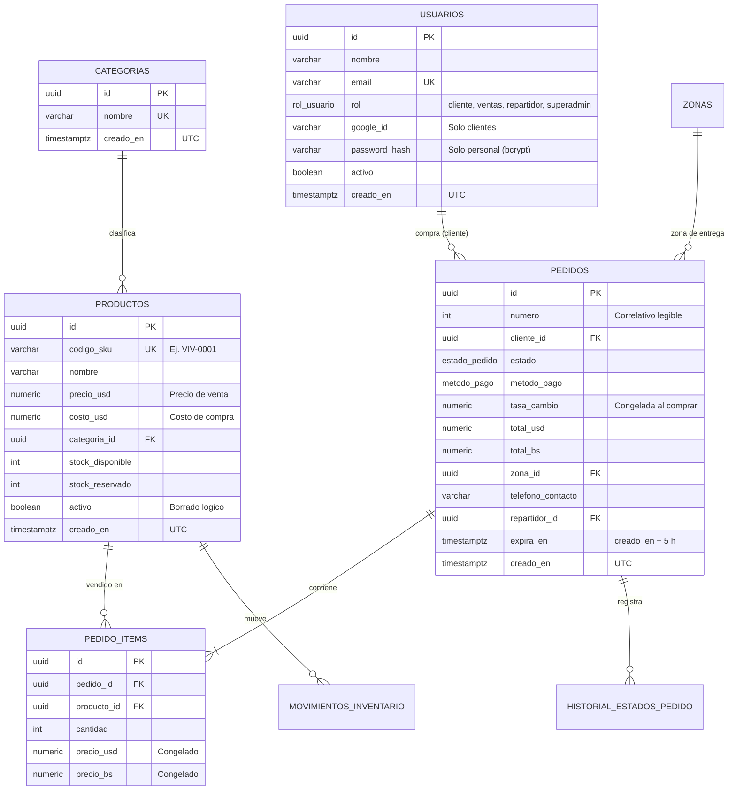

# Sistema E-commerce para Supermercado · API Backend

### **Asignatura: Desarrollo de Aplicaciones Web (Código: 0423807T)**

**Facilitador:** M.Sc. Ing. Gabriel Alexis Ramírez Sánchez  
**Email:** gramirezs@unet.edu.ve  
**Período Académico:** Septiembre, 2026  
**San Cristóbal, Estado Táchira, Venezuela**

**Integrantes del equipo:**

| Integrante | Rol en el proyecto |
| :--- | :--- |
| Gregorio Briceño | Desarrollo backend |
| Francisco Sánchez | Desarrollo backend |
| María Fernanda Cachopo Rojas | Gestión del proyecto (Scrum) y documentación |

---

## 📌 Descripción General

Este repositorio contiene la **API REST (backend)** de una plataforma de comercio electrónico para un supermercado. La API resuelve la lógica del negocio y la persistencia de datos: catálogo, carrito y creación de pedidos con métodos de pago locales (transferencia, pago móvil y Binance) y comprobante adjunto, inventario con reserva de stock, aprobación y entrega de pedidos, notificaciones por WhatsApp, auditoría, indicadores (KPIs) e informe en Excel.

> **Alcance del repositorio:** aquí solo vive el backend. Las aplicaciones cliente (frontend) se desarrollan en repositorios separados y se comunican con esta API mediante HTTP/JSON.

La API atiende a **cuatro tipos de usuario**:

| Rol | Quién es | Cómo inicia sesión |
| :--- | :--- | :--- |
| **Superadmin** | Gerente del supermercado | Correo y contraseña |
| **Ventas** | Personal que revisa y aprueba los pedidos | Correo y contraseña creados por el gerente |
| **Repartidor** | Personal que entrega los pedidos | Correo y contraseña creados por el gerente |
| **Cliente** | Persona que compra | Cuenta de Google |

La arquitectura aplica **Onion Architecture** sobre **.NET 10 (C# 14)** para lograr un desacoplamiento estricto entre el dominio del negocio y la infraestructura tecnológica, con persistencia en **PostgreSQL** mediante **Entity Framework Core 10**.

La documentación técnica detallada se encuentra en la carpeta [`docs/`](docs/).

---

## 🏛️ Arquitectura del Sistema

El backend se distribuye en capas concéntricas. Las dependencias apuntan siempre hacia el centro: el dominio no conoce a ninguna otra capa.

```
┌────────────────────────────────────────────────────────┐
│                   Presentation.API                     │
│   Controladores REST, DTOs, autenticación JWT/Google,  │
│   middleware global de errores (RFC 7807)              │
├────────────────────────────────────────────────────────┤
│                   Infrastructure                       │
│  EF Core 10 + Npgsql, repositorios, Unit of Work,      │
│  almacenamiento de archivos, WhatsApp, job expiración  │
├────────────────────────────────────────────────────────┤
│                   Core.Application                     │
│   Casos de uso (servicios) e interfaces (contratos)    │
├────────────────────────────────────────────────────────┤
│                     Core.Domain                        │
│   BaseEntity, entidades, enums y reglas de negocio     │
└────────────────────────────────────────────────────────┘
```

**Regla de dependencia:** `Presentation.API → Core.Application, Infrastructure` · `Infrastructure → Core.Application → Core.Domain`.

### Componentes Clave:
1. **Core.Domain:** clase base `BaseEntity` (`Id` Guid + `CreatedAt` UTC) de la que heredan todas las entidades del negocio (`Producto`, `Categoria`, `Pedido`, `PedidoItem`, `Usuario`, `Zona`, etc.), enumeraciones (`RolUsuario`, `EstadoPedido`, `MetodoPago`…) y reglas puras (`TransicionesPedido`, validación de teléfonos venezolanos). **No tiene dependencias de paquetes externos.**
2. **Core.Application:** casos de uso (`PedidosService`, `InventarioService`, `ReportesService`, `AuditoriaService`, `TasaService`) y los contratos que implementa la infraestructura (`IUnitOfWork`, repositorios, almacenamiento de archivos). No conoce EF Core.
3. **Infrastructure:** persistencia con **EF Core 10 (Code-First + Fluent API)**, una `IEntityTypeConfiguration<T>` por entidad, migraciones, repositorios, datos semilla y de demostración, subida de comprobantes (Cloudinary o disco local), generación del informe en Excel, cola de envío de WhatsApp y el job de expiración de pedidos.
4. **Presentation.API:** endpoints REST protegidos con **JWT Bearer** y autorización por roles (**RBAC**), inicio de sesión con Google para clientes, `ExceptionMiddleware` que responde los errores en formato **RFC 7807** (`application/problem+json`) y configuración de la inyección de dependencias (Scoped, Singleton y Transient).

Más detalle en [`docs/ARQUITECTURA.md`](docs/ARQUITECTURA.md).

---

## 🔄 Flujo de un Pedido

```
Cliente confirma el pedido  (se reserva el stock)
        │
        ▼
    PENDIENTE ──── 5 horas sin revisar ────► EXPIRADO   (stock liberado + WhatsApp)
        │
        ├── Ventas rechaza ──► RECHAZADO                 (stock liberado + WhatsApp)
        │
        └── Ventas aprueba y asigna repartidor           (stock confirmado)
                │
                ▼
            ASIGNADO ──► EN CAMINO ──► ENTREGADO         (WhatsApp en cada paso)
```

Las reglas completas (reserva de stock, expiración, tasa de cambio, mensajes) están en [`docs/REGLAS_NEGOCIO.md`](docs/REGLAS_NEGOCIO.md).

---

## 🗄️ Modelo Entidad-Relación (Base de Datos PostgreSQL)

Esquema principal mapeado con **Entity Framework Core 10 (Code-First + Fluent API)**. Todas las claves primarias son **UUID** y las fechas se guardan en **UTC**. Los nombres de tablas y columnas usan `snake_case`.



El modelo completo (13 tablas y 8 enumeraciones) está en [`docs/MODELO_DATOS.md`](docs/MODELO_DATOS.md).

---

## 🚀 Tecnologías Empleadas

- **Backend:** .NET 10 (C# 14), ASP.NET Core Web API.
- **ORM & Base de Datos:** Entity Framework Core 10, Npgsql, EFCore.NamingConventions, PostgreSQL 16.
- **Seguridad:** JSON Web Tokens (JWT) con HMAC-SHA256, contraseñas con **BCrypt**, inicio de sesión de clientes con **Google** (`Google.Apis.Auth`).
- **Archivos:** Cloudinary para los comprobantes de pago (en desarrollo, disco local).
- **Reportes:** endpoint de KPIs e informe en Excel generado con **ClosedXML**.
- **Datos de demostración:** **Bogus** para simular clientes y pedidos.
- **Mensajería:** WhatsApp mediante un microservicio con **Baileys** (Node.js).
- **Contenerización:** Docker y Docker Compose.

---

## 🛠️ Requisitos Previos

- [SDK de .NET 10](https://dotnet.microsoft.com/download)
- [PostgreSQL 16](https://www.enterprisedb.com/downloads/postgres-postgresql-downloads) (incluye pgAdmin 4)
- [Git](https://git-scm.com/)
- Opcional: [Docker Desktop](https://www.docker.com/products/docker-desktop/) para levantar la base de datos en un contenedor.

---

## 📦 Puesta en Marcha

### 1. Clonar y compilar

```bash
git clone https://github.com/FranciscoSanchez001/Backend_Almacen.git
cd Backend_Almacen
dotnet build Backend_Almacen.slnx
```

### 2. Preparar la base de datos

La API usa la cadena de conexión de `Presentation.API/appsettings.Development.json`:

| Parámetro | Valor |
| :--- | :--- |
| Servidor | `localhost:5432` |
| Base de datos | `midatabase` |
| Usuario | `miusuario` |
| Contraseña | `mipassword` |

**Opción A: PostgreSQL instalado en la computadora.** En pgAdmin, abrir el *Query Tool* sobre la base `postgres` y ejecutar **cada instrucción por separado** (seleccionar la línea y pulsar F5):

```sql
CREATE USER miusuario WITH PASSWORD 'mipassword';
```

```sql
CREATE DATABASE midatabase OWNER miusuario;
```

**Opción B: Docker.** El `docker-compose.yml` ya trae PostgreSQL con esos mismos datos:

```bash
docker compose up -d db
```

### 3. Crear las tablas (migraciones)

```bash
dotnet tool restore
dotnet ef database update --project Infrastructure --startup-project Presentation.API
```

Se crean las 13 tablas y los datos semilla. Cada vez que el equipo agregue una migración nueva, se repite el último comando.

### 4. Ejecutar la API

```bash
dotnet run --project Presentation.API
```

### Puntos de Acceso del Sistema:
- **Backend API REST:** [http://localhost:5085](http://localhost:5085)
- **Documento OpenAPI:** [http://localhost:5085/openapi/v1.json](http://localhost:5085/openapi/v1.json)
- **Diagnóstico de la base de datos:** [http://localhost:5085/DbTest](http://localhost:5085/DbTest)
- **Base de Datos PostgreSQL:** `localhost:5432` (`midatabase`)

### Comandos útiles

```bash
# Crear una migración nueva
dotnet ef migrations add <Nombre> --project Infrastructure --startup-project Presentation.API --output-dir Persistencia/Migraciones

# Regenerar el script SQL de la base de datos
dotnet ef migrations script --project Infrastructure --startup-project Presentation.API --idempotent -o database/InitialCreate.sql

# Construir la imagen Docker de la API
docker build -f Presentation.API/Dockerfile -t backend-almacen .
```

---

## 👤 Credenciales y Datos Preconfigurados (Datos de Siembra)

Al arrancar, la API crea el usuario gerente si no existe:

| Rol | Correo | Contraseña | Permisos |
| :--- | :--- | :--- | :--- |
| **Superadmin** | `gerente@almacen.local` | `Cambiar123!` | Acceso total, incluido el borrado de productos. |

Los usuarios de **ventas** y **repartidor** los crea el gerente; los **clientes** se registran solos al iniciar sesión con Google.

La migración siembra además:
- **4 categorías:** Víveres, Lácteos y huevos, Bebidas, Limpieza del hogar.
- **11 productos** con SKU, precio, costo y stock.
- **5 zonas de entrega** de San Cristóbal: Centro, Barrio Obrero, Pueblo Nuevo, La Concordia y Santa Teresa.

> Estas credenciales son solo para desarrollo. En producción deben cambiarse en la sección `SuperadminInicial` de la configuración.

### Datos de demostración (opcional)

Para probar los KPIs, el informe en Excel y el resto de endpoints con información realista, la API puede generar datos simulados con **Bogus**: personal, clientes, productos adicionales, historial de tasas y **90 días de pedidos**.

```bash
dotnet run --project Presentation.API -- --SiembraDemo:Habilitada=true
```

- Solo funciona en entorno de desarrollo y **solo si la base de datos todavía no tiene pedidos**.
- Usa una semilla fija, así que siempre genera los mismos datos.
- Crea al personal de prueba, todos con la contraseña `Demo1234!`:

| Rol | Correos |
| :--- | :--- |
| **Ventas** | `ventas1@almacen.local`, `ventas2@almacen.local` |
| **Repartidor** | `repartidor1@almacen.local`, `repartidor2@almacen.local`, `repartidor3@almacen.local` |

La cantidad de días, de clientes, la contraseña y la semilla se ajustan en la sección `SiembraDemo` de la configuración.

---

## 🧪 Pruebas de la API

El archivo [`Presentation.API/Presentation.API.http`](Presentation.API/Presentation.API.http) contiene peticiones de ejemplo listas para ejecutar desde Visual Studio o VS Code (extensión *REST Client*):

1. Ejecutar **Login del personal** y copiar el `token` de la respuesta.
2. Pegarlo en la variable `@token` al inicio del archivo.
3. Ejecutar el resto de peticiones.

Ejemplo con cURL:

```bash
curl -X POST http://localhost:5085/auth/login \
  -H "Content-Type: application/json" \
  -d "{\"email\":\"gerente@almacen.local\",\"password\":\"Cambiar123!\"}"
```

El listado completo de endpoints, con el rol que exige cada uno, está en [`docs/API.md`](docs/API.md).

### Colección de Postman

[`docs/postman/Backend_Almacen.postman_collection.json`](docs/postman/Backend_Almacen.postman_collection.json) trae 62 peticiones agrupadas por área. Se importa en Postman (o en Bruno, con *Import Collection → Postman*).

- La variable `baseUrl` apunta a `http://localhost:5085`.
- **Login del personal** guarda el token solo en la variable `token`, que usan el resto de peticiones.
- Los listados guardan el primer id (`productoId`, `pedidoId`, `zonaId`…) para las peticiones de detalle.
- La carpeta **Errores RFC 7807** trae pruebas automáticas: revisan el código HTTP, el `Content-Type: application/problem+json`, los campos del Problem Details y, en el error 500, que no se filtre el detalle interno.

### Manejo de errores (RFC 7807)

Las excepciones no controladas las atiende `ExceptionMiddleware` y se responden en formato Problem Details:

| Excepción | Código |
| :--- | :---: |
| `KeyNotFoundException` | `404` |
| `InvalidOperationException` | `400` |
| Cualquier otra | `500` (mensaje genérico, sin *stack trace*) |

Para probarlo sin tocar datos:

```bash
curl -i http://localhost:5085/pruebas/errores/no-encontrado
curl -i http://localhost:5085/pruebas/errores/operacion-invalida
curl -i http://localhost:5085/pruebas/errores/interno
```

Las respuestas reales están en [`docs/evidencias/errores-rfc7807.md`](docs/evidencias/errores-rfc7807.md).

---

## ⚙️ Configuración

Secciones de `Presentation.API/appsettings.Development.json`:

| Sección | Para qué sirve | ¿Obligatoria en local? |
| :--- | :--- | :---: |
| `ConnectionStrings:Almacen` | Conexión a PostgreSQL | Sí |
| `Jwt` | Emisor, audiencia y clave de firma de los tokens (mínimo 32 caracteres) | Sí |
| `SuperadminInicial` | Usuario gerente que se crea al arrancar | Sí |
| `Google:ClientId` | Inicio de sesión de clientes con Google | No |
| `Cloudinary` | Almacenamiento de comprobantes; si está vacío se usa disco local | No |
| `Whatsapp` | URL y clave del microservicio de Baileys; si está vacío no se envían mensajes | No |
| `Expiracion` | Cada cuánto corre el job de expiración y con cuánta anticipación avisa | No |
| `SiembraDemo` | Generación de datos de demostración (desactivada por defecto) | No |

> **Antes de crear pedidos**, el gerente debe cargar la tasa Bs/USD del día con `PUT /configuracion/tasa`. Sin tasa cargada, la tienda no acepta compras. La siembra de demostración ya carga un historial de tasas.

---

## 📂 Estructura del Repositorio

```
Backend_Almacen/
├── Core.Domain/                # BaseEntity, entidades, enums y reglas de negocio puras
│   ├── Comun/                  # BaseEntity (Id + CreatedAt)
│   ├── Entidades/
│   ├── Enums/
│   └── Reglas/
├── Core.Application/           # Casos de uso y contratos
│   ├── Abstracciones/          # Interfaces de repositorios, Unit of Work y servicios externos
│   ├── Servicios/              # PedidosService, InventarioService, ReportesService…
│   └── Modelos/                # Modelos de lectura y de reportes (KPIs)
├── Infrastructure/             # Implementaciones técnicas
│   ├── Persistencia/           # DbContext, configuraciones Fluent API, migraciones, repositorios, semillas
│   ├── Archivos/               # Cloudinary / disco local
│   ├── Reportes/               # Generador del informe en Excel (ClosedXML)
│   ├── Mensajeria/             # Envío de WhatsApp
│   ├── Jobs/                   # Expiración automática de pedidos
│   └── Seguridad/              # Hash de contraseñas (BCrypt)
├── Presentation.API/           # Controladores, DTOs, autenticación, middleware y Program.cs
│   └── Middleware/             # ExceptionMiddleware (RFC 7807)
├── database/
│   └── InitialCreate.sql       # Script SQL generado desde las migraciones
├── docs/                       # Documentación técnica del proyecto
│   ├── postman/                # Colección de Postman
│   └── evidencias/             # Respuestas reales de error en formato RFC 7807
├── docker-compose.yml          # PostgreSQL en contenedor
├── dotnet-tools.json           # Herramienta dotnet-ef
├── Backend_Almacen.slnx        # Solución de .NET
└── README.md
```

---

## 📚 Documentación del Proyecto

| Documento | Contenido |
| :--- | :--- |
| [`docs/ARQUITECTURA.md`](docs/ARQUITECTURA.md) | Capas, regla de dependencia, inyección de dependencias y ciclos de vida |
| [`docs/MODELO_DATOS.md`](docs/MODELO_DATOS.md) | Diagrama entidad-relación completo, tablas y enumeraciones |
| [`docs/API.md`](docs/API.md) | Endpoints, roles requeridos y ejemplos |
| [`docs/REGLAS_NEGOCIO.md`](docs/REGLAS_NEGOCIO.md) | Flujo del pedido, stock, expiración, tasa de cambio y WhatsApp |
| [`docs/GESTION_PROYECTO.md`](docs/GESTION_PROYECTO.md) | Metodología Scrum, épicas, carriles de trabajo y convención de commits |
| [`docs/postman/`](docs/postman/Backend_Almacen.postman_collection.json) | Colección de Postman con todos los endpoints y las pruebas de errores RFC 7807 |
| [`docs/evidencias/errores-rfc7807.md`](docs/evidencias/errores-rfc7807.md) | Respuestas reales de error en formato Problem Details |
