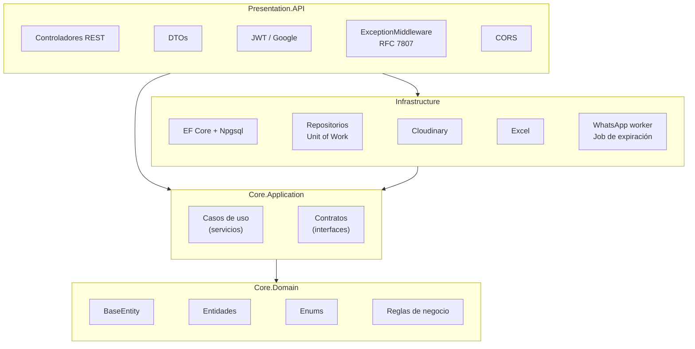
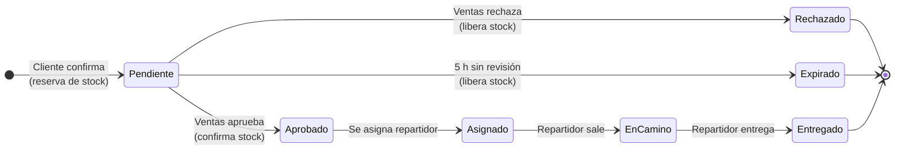
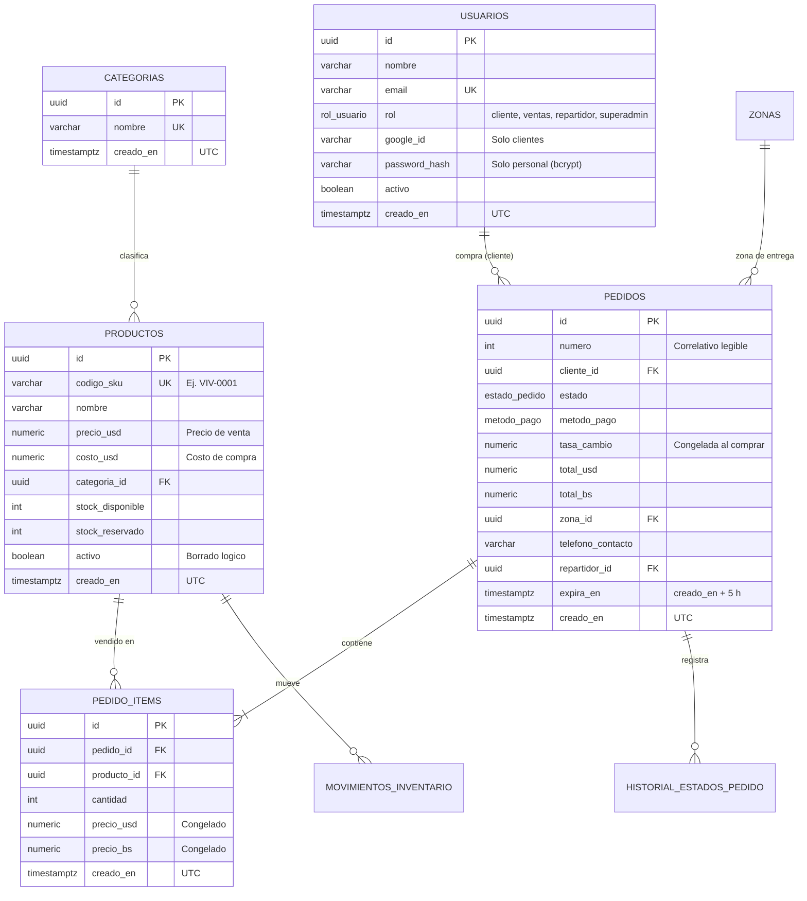

<div align="center">

# Sistema E-commerce para Supermercado

### API REST · Backend

Plataforma de comercio electrónico para un supermercado: catálogo, pedidos con pagos locales,
inventario con reserva de stock, logística de entrega, notificaciones por WhatsApp, auditoría e indicadores de negocio.

<br>


<br><br>


</div>

---

## Tabla de contenidos

1. [Información académica](#1-información-académica)
2. [Descripción general](#2-descripción-general)
3. [Stack tecnológico](#3-stack-tecnológico)
4. [Arquitectura](#4-arquitectura)
5. [Ciclo de vida del pedido](#5-ciclo-de-vida-del-pedido)
6. [Modelo de datos](#6-modelo-de-datos)
7. [Seguridad y manejo de errores](#7-seguridad-y-manejo-de-errores)
8. [Requisitos previos](#8-requisitos-previos)
9. [Instalación y ejecución](#9-instalación-y-ejecución)
10. [Datos semilla y credenciales](#10-datos-semilla-y-credenciales)
11. [Pruebas de la API](#11-pruebas-de-la-api)
12. [Configuración](#12-configuración)
13. [Estructura del repositorio](#13-estructura-del-repositorio)
14. [Documentación técnica](#14-documentación-técnica)

---

## 1. Información académica

| | |
| :--- | :--- |
| **Asignatura** | Desarrollo de Aplicaciones Web (Código 0423807T) |
| **Facilitador** | M.Sc. Ing. Gabriel Alexis Ramírez Sánchez · <gramirezs@unet.edu.ve> |
| **Institución** | Universidad Nacional Experimental del Táchira (UNET) |
| **Período académico** | Septiembre 2026 |
| **Ubicación** | San Cristóbal, Estado Táchira, Venezuela |

**Equipo de desarrollo**

| Integrante | Rol |
| :--- | :--- |
| Gregorio Briceño | Desarrollo backend |
| Francisco Sánchez | Desarrollo backend |
| María Fernanda Cachopo Rojas | Gestión del proyecto (Scrum) y documentación |

---

## 2. Descripción general

Este repositorio contiene la **API REST** de la plataforma. Concentra la lógica de negocio y la persistencia de datos; las aplicaciones cliente (frontend) se desarrollan en repositorios separados y se comunican con la API mediante HTTP/JSON.

**Capacidades principales**

- Catálogo público con precios en USD y en bolívares según la tasa del día.
- Creación de pedidos con pago por transferencia, pago móvil o Binance y comprobante adjunto.
- Inventario con **reserva de stock** al crear el pedido y liberación automática si se rechaza o expira.
- Aprobación de pedidos por el área de ventas y asignación de repartidor.
- Seguimiento de la entrega y notificaciones al cliente por WhatsApp en cada cambio de estado.
- Auditoría de cambios, indicadores de negocio (KPIs) e informe descargable en Excel.

**Perfiles de usuario**

| Rol | Descripción | Autenticación |
| :--- | :--- | :--- |
| `superadmin` | Gerente del supermercado; acceso total | Correo y contraseña |
| `ventas` | Revisa, aprueba o rechaza los pedidos | Correo y contraseña (creados por el gerente) |
| `repartidor` | Entrega los pedidos asignados | Correo y contraseña (creados por el gerente) |
| `cliente` | Compra en la tienda | Cuenta de Google |

---

## 3. Stack tecnológico

| Área | Tecnología | Versión | Uso en el proyecto |
| :--- | :--- | :---: | :--- |
| Plataforma | .NET / C# | 10 / 14 | Runtime y lenguaje |
| Framework web | ASP.NET Core Web API | 10 | Controladores REST, pipeline HTTP, inyección de dependencias |
| Persistencia | Entity Framework Core + Npgsql | 10 | ORM Code-First con Fluent API y migraciones |
| Base de datos | PostgreSQL | 16 | Almacenamiento relacional con enums nativos y `timestamptz` |
| Convenciones | EFCore.NamingConventions | 10.0.1 | Tablas y columnas en `snake_case` |
| Autenticación | JWT Bearer | 10.0.12 | Tokens firmados con HMAC-SHA256 |
| Identidad de clientes | Google.Apis.Auth | 1.76.0 | Validación del ID token de Google Sign-In |
| Contraseñas | BCrypt.Net-Next | 4.0.3 | Hash de contraseñas del personal |
| Archivos | CloudinaryDotNet | 1.29.3 | Comprobantes de pago (disco local en desarrollo) |
| Reportes | ClosedXML | 0.105.1 | Informe en formato `.xlsx` |
| Datos de prueba | Bogus | 35.6.5 | Generación de datos de demostración |
| Mensajería | Baileys (Node.js) | — | Microservicio externo de WhatsApp |
| Documentación de la API | Microsoft.AspNetCore.OpenApi | 10.0.12 | Documento OpenAPI en `/openapi/v1.json` |
| Contenedores | Docker / Docker Compose | — | Imagen de la API y base de datos local |

---

## 4. Arquitectura

La solución aplica **Onion Architecture**: cuatro proyectos concéntricos en los que las dependencias apuntan siempre hacia el dominio. El dominio no depende de ninguna otra capa ni de paquetes externos.



| Proyecto | Responsabilidad | Depende de |
| :--- | :--- | :--- |
| `Core.Domain` | `BaseEntity` (`Id` + `CreatedAt` UTC), 13 entidades, enumeraciones y reglas puras (`TransicionesPedido`, validación de teléfonos) | Ninguno |
| `Core.Application` | Casos de uso (`PedidosService`, `InventarioService`, `ReportesService`, `AuditoriaService`, `TasaService`) y contratos (`IUnitOfWork`, repositorios, servicios externos) | `Core.Domain` |
| `Infrastructure` | EF Core 10 con una `IEntityTypeConfiguration<T>` por entidad, migraciones, repositorios, semillas, almacenamiento de archivos, informe Excel, envío de WhatsApp y job de expiración | `Core.Application` |
| `Presentation.API` | Endpoints REST, DTOs, autenticación JWT y Google, autorización por roles, manejo global de errores, CORS y composición de dependencias | `Core.Application`, `Infrastructure` |

**Ciclos de vida registrados en el contenedor de dependencias**

| Ciclo de vida | Servicios |
| :--- | :--- |
| Scoped | `ApplicationDbContext`, `IUnitOfWork`, repositorios, servicios de aplicación, `TokenService` |
| Singleton | Hash BCrypt, generador de Excel, almacenamiento de archivos, cola de WhatsApp, opciones de configuración |
| Transient | `ExceptionMiddleware` (implementa `IMiddleware`) |
| Hosted Service | `EnvioWhatsappWorker`, `ExpiracionPedidosJob` |

Detalle completo en [`docs/ARQUITECTURA.md`](docs/ARQUITECTURA.md).

---

## 5. Ciclo de vida del pedido



- Toda transición se valida en el dominio (`Pedido.CambiarEstado`) y queda registrada en el historial del pedido.
- Aprobar y asignar ocurren en la misma operación: no se aprueba un pedido sin repartidor.
- Cada operación bloquea la fila del pedido (`SELECT ... FOR UPDATE`), de modo que dos vendedores o el job de expiración no pueden modificar el mismo pedido a la vez.
- El cliente recibe un mensaje de WhatsApp en cada cambio de estado.

Reglas completas en [`docs/REGLAS_NEGOCIO.md`](docs/REGLAS_NEGOCIO.md).

---

## 6. Modelo de datos

Esquema mapeado con **Entity Framework Core 10 (Code-First + Fluent API)**. Todas las entidades heredan de `BaseEntity`, por lo que cada tabla tiene clave primaria **UUID** (`id`) y fecha de creación en **UTC** (`creado_en`). Tablas y columnas en `snake_case`.



El modelo completo (13 tablas y 8 enumeraciones) está en [`docs/MODELO_DATOS.md`](docs/MODELO_DATOS.md).

---

## 7. Seguridad y manejo de errores

| Aspecto | Implementación |
| :--- | :--- |
| Autenticación del personal | `POST /auth/login` con correo y contraseña verificada contra hash **BCrypt** |
| Autenticación de clientes | `POST /auth/google` con el ID token de Google, validado contra el Client ID configurado |
| Tokens | **JWT** firmado con HMAC-SHA256; se revalida en cada petición que el usuario siga activo |
| Autorización | Control de acceso por roles (**RBAC**) con `[Authorize(Roles = ...)]` |
| CORS | Política `Frontend` con orígenes configurables en `Cors:OrigenesPermitidos` |
| Errores | `ExceptionMiddleware` global con **Problem Details (RFC 7807)** |

**Correspondencia de excepciones**

| Excepción | Código HTTP | Contenido de `detail` |
| :--- | :---: | :--- |
| `KeyNotFoundException` | `404 Not Found` | Mensaje de negocio |
| `InvalidOperationException` | `400 Bad Request` | Mensaje de negocio |
| Cualquier otra | `500 Internal Server Error` | Mensaje genérico; el detalle interno y la traza solo se registran en el log |

```http
HTTP/1.1 500 Internal Server Error
Content-Type: application/problem+json

{
  "type": "https://tools.ietf.org/html/rfc9110#section-15.6.1",
  "title": "Error interno del servidor",
  "status": 500,
  "detail": "Ocurrió un error inesperado. Intenta de nuevo más tarde.",
  "instance": "/pruebas/errores/interno",
  "traceId": "00-9ec4162eb81c08e9f77dcd719eb97315-cc7a21935643c750-00"
}
```

---

## 8. Requisitos previos

| Herramienta | Versión | Obligatoria |
| :--- | :---: | :---: |
| [SDK de .NET](https://dotnet.microsoft.com/download) | 10 | Sí |
| [PostgreSQL](https://www.postgresql.org/download/) (incluye pgAdmin 4) | 16 | Sí, salvo que se use Docker |
| [Git](https://git-scm.com/) | — | Sí |
| [Docker Desktop](https://www.docker.com/products/docker-desktop/) | — | Opcional |

---

## 9. Instalación y ejecución

### 9.1 Clonar y compilar

```bash
git clone https://github.com/FranciscoSanchez001/Backend_Almacen.git
cd Backend_Almacen
dotnet build Backend_Almacen.slnx
```

### 9.2 Preparar la base de datos

La cadena de conexión está en `Presentation.API/appsettings.Development.json`:

| Parámetro | Valor |
| :--- | :--- |
| Servidor | `localhost:5432` |
| Base de datos | `midatabase` |
| Usuario | `miusuario` |
| Contraseña | `mipassword` |

**Opción A. PostgreSQL local.** En pgAdmin, abrir el *Query Tool* sobre la base `postgres` y ejecutar cada instrucción por separado:

```sql
CREATE USER miusuario WITH PASSWORD 'mipassword';
```

```sql
CREATE DATABASE midatabase OWNER miusuario;
```

**Opción B. Docker.** El `docker-compose.yml` incluye PostgreSQL con los mismos datos:

```bash
docker compose up -d db
```

### 9.3 Aplicar las migraciones

```bash
dotnet tool restore
dotnet ef database update --project Infrastructure --startup-project Presentation.API
```

Crea las 13 tablas y los datos semilla. El comando se repite cada vez que se incorpora una migración nueva.

### 9.4 Ejecutar la API

```bash
dotnet run --project Presentation.API
```

| Recurso | Dirección |
| :--- | :--- |
| API REST | <http://localhost:5085> |
| Documento OpenAPI | <http://localhost:5085/openapi/v1.json> |
| Diagnóstico de la base de datos (requiere token de superadmin) | <http://localhost:5085/DbTest> |
| PostgreSQL | `localhost:5432` (`midatabase`) |

### 9.5 Comandos de referencia

```bash
# Crear una migración
dotnet ef migrations add <Nombre> --project Infrastructure --startup-project Presentation.API --output-dir Persistencia/Migraciones

# Regenerar el script SQL de la base de datos
dotnet ef migrations script --project Infrastructure --startup-project Presentation.API --idempotent -o database/InitialCreate.sql

# Exportar el volcado de la base (esquema + datos sembrados)
docker exec postgres_db pg_dump -U miusuario -d midatabase --no-owner --no-privileges --column-inserts \
  | sed '/^[\]restrict /d;/^[\]unrestrict /d' > database/midatabase_dump.sql

# Construir la imagen Docker de la API
docker build -f Presentation.API/Dockerfile -t backend-almacen .
```

---

## 10. Datos semilla y credenciales

Al arrancar, la API crea el usuario gerente si no existe:

| Rol | Correo | Contraseña | Permisos |
| :--- | :--- | :--- | :--- |
| **Superadmin** | `gerente@almacen.local` | `Cambiar123!` | Acceso total, incluido el borrado de productos. |

Los usuarios de **ventas** y **repartidor** los crea el gerente; los **clientes** se registran solos al iniciar sesión con Google.

La migración siembra además:

- **4 categorías:** Víveres, Lácteos y huevos, Bebidas, Limpieza del hogar.
- **11 productos** con SKU, precio, costo y stock.
- **5 zonas de entrega** de San Cristóbal: Centro, Barrio Obrero, Pueblo Nuevo, La Concordia y Santa Teresa.

> Estas credenciales son exclusivas del entorno de desarrollo. En producción se reemplazan en la sección `SuperadminInicial` de la configuración.

### Datos de demostración

Para evaluar los KPIs, el informe en Excel y el resto de endpoints con información realista, la API genera datos simulados con **Bogus**: personal, clientes, productos adicionales, historial de tasas y 90 días de pedidos.

```bash
dotnet run --project Presentation.API -- --SiembraDemo:Habilitada=true
```

- Disponible solo en desarrollo y únicamente si la base de datos todavía no tiene pedidos.
- Usa una semilla fija, por lo que siempre genera los mismos datos.
- Todo el personal de prueba usa la contraseña `Demo1234!`:

| Rol | Correos |
| :--- | :--- |
| `ventas` | `ventas1@almacen.local`, `ventas2@almacen.local` |
| `repartidor` | `repartidor1@almacen.local`, `repartidor2@almacen.local`, `repartidor3@almacen.local` |

---

## 11. Pruebas de la API

### Pruebas unitarias (xUnit + Moq)

El proyecto [`tests/UnitTests`](tests/UnitTests) prueba `ProductoService` sin base de datos: `IProductoRepository`, `ICategoriaRepository`, `IUnitOfWork` y los repositorios de inventario, notificaciones y auditoría se simulan con Moq.

```bash
dotnet test     # todas las pruebas de la solución (las de integración necesitan Docker)
```

| Caso de uso | Qué se comprueba |
| :--- | :--- |
| `CrearAsync` | Normalización del SKU, el nombre y la unidad; redondeo de precios; transacción confirmada; movimiento de stock inicial; auditoría; `409` si el SKU está en uso y `400` si la categoría no existe |
| `ActualizarAsync` | `404` si no existe; `409` si el SKU es de otro producto; auditoría con el antes y el después; sin cambios no guarda; ajuste de stock con su movimiento, aviso de agotado y resolución del aviso; `409` si el stock cambió mientras se editaba |
| `BorrarAsync` | Borrado lógico auditado y `404` si no existe |

Resultado: **17 pruebas, 0 fallos**.

### Pruebas de arquitectura (NetArchTest.Rules)

[`tests/ArchitectureTests`](tests/ArchitectureTests) inspecciona los ensamblados compilados y falla si se rompe la regla de dependencia (`Presentation.API → Infrastructure → Core.Application → Core.Domain`) o alguna convención:

| Regla | Qué se comprueba |
| :--- | :--- |
| Dependencias entre capas | Domain no depende de ninguna otra capa ni de EF Core, Npgsql, ASP.NET Core o FluentValidation; Application no depende de Infrastructure, Presentation, EF Core ni ASP.NET Core; Infrastructure no depende de Presentation; los controladores no usan Infrastructure ni EF Core |
| Convenciones | Las entidades heredan de `BaseEntity`; los contratos `*Repository` son interfaces en `Core.Application.Abstracciones` y sus implementaciones, clases en `Infrastructure.Persistencia.Repositorios`; las interfaces empiezan con `I`; los validadores terminan en `Validator`; los controladores terminan en `Controller`, heredan de `ControllerBase` y están en `Presentation.API.Controllers` |

Resultado: **13 pruebas, 0 fallos**.

### Pruebas de integración (WebApplicationFactory + Testcontainers)

[`tests/IntegrationTests`](tests/IntegrationTests) levanta la API completa en memoria (middleware, JWT, filtros, EF Core) contra un **PostgreSQL 16 real en Docker**, con las migraciones aplicadas. No se usa el proveedor InMemory porque el esquema depende de enums nativos de PostgreSQL y de `UPDATE` condicionales y `SELECT ... FOR UPDATE`. **Requiere Docker en ejecución**.

| Área | Escenarios |
| :--- | :--- |
| Autenticación | Login del superadmin inicial; contraseña incorrecta → `401`; `GET /auth/yo`; rotación del refresh token y cierre de todas las sesiones al reutilizar uno ya usado |
| Seguridad (RBAC) | Sin token o con un token inválido → `401`; listado público de categorías; Employee consulta productos, pero recibe `403` al borrar productos, crear categorías o gestionar usuarios; un usuario desactivado pierde el acceso aunque su JWT siga vigente |
| Productos | Alta → `201` con `Location`, movimiento de stock y auditoría en la base; SKU repetido → `409`; precio negativo → `400` con `errors.precioUsd`; categoría inexistente → `400`; edición con ajuste de stock registrado; `404` al editar uno inexistente; borrado lógico que lo saca del catálogo; el catálogo no muestra productos sin stock |

Resultado: **20 pruebas, 0 fallos**. Para ejecutar solo las que no necesitan Docker:

```bash
dotnet test tests/UnitTests
dotnet test tests/ArchitectureTests
```

### Colección de Postman

[`docs/postman/Backend_Almacen.postman_collection.json`](docs/postman/Backend_Almacen.postman_collection.json) contiene 62 peticiones organizadas por área funcional. Es compatible con Postman y con Bruno (*Import Collection → Postman Collection*).

| Característica | Descripción |
| :--- | :--- |
| Variables | `baseUrl` (`http://localhost:5085`), `token` e identificadores de recursos |
| Autenticación | La petición *Login del personal* guarda el JWT en `token` automáticamente |
| Encadenamiento | Los listados guardan el primer identificador para las peticiones de detalle |
| Pruebas automáticas | La carpeta *Errores RFC 7807* verifica el código HTTP, el `Content-Type`, la estructura del Problem Details y que el error 500 no exponga detalles internos |

### Colección de escenarios de seguridad

[`docs/postman/Seguridad_Escenarios.postman_collection.json`](docs/postman/Seguridad_Escenarios.postman_collection.json) es una colección autocontenida con los cuatro escenarios de seguridad comprobados (Admin = `superadmin`, Employee = `ventas`):

| # | Escenario | Respuesta esperada |
| :---: | :--- | :--- |
| 1 | Login exitoso con rol Admin y con rol Employee | `200 OK` con JWT y rol |
| 2 | `GET /productos` sin token | `401 Unauthorized` |
| 3 | `DELETE /productos/{id}` con token de Employee | `403 Forbidden` (y el producto sigue activo) |
| 4 | `POST /productos` con precio negativo | `400 Bad Request` con `errors.precioUsd = ["El precio debe ser mayor que 0."]` |

```bash
npx newman run docs/postman/Seguridad_Escenarios.postman_collection.json --env-var "baseUrl=http://localhost:5085"
```

Resultado: **7 peticiones, 21 aserciones, 0 fallos**. Se puede repetir: el alta del Employee de prueba acepta `201` o `409` si ya existe. Las peticiones y respuestas reales de cada escenario están en [`docs/evidencias/escenarios-seguridad.md`](docs/evidencias/escenarios-seguridad.md).

### Endpoints de prueba de errores

```bash
curl -X POST http://localhost:5085/auth/login \
  -H "Content-Type: application/json" \
  -d "{\"email\":\"gerente@almacen.local\",\"password\":\"Cambiar123!\"}"
```

El listado completo de endpoints, con el rol que exige cada uno, está en [`docs/API.md`](docs/API.md).

### Colección de Postman

[`docs/postman/Backend_Almacen.postman_collection.json`](docs/postman/Backend_Almacen.postman_collection.json) trae 62 peticiones agrupadas por área. Se importa en Postman (o en Bruno, con *Import Collection → Postman*).

- La variable `baseUrl` apunta a `http://localhost:5085`.
- **Login del personal** guarda el token solo en la variable `token`, que usan el resto de peticiones.
- Los listados guardan el primer id (`productoId`, `pedidoId`, `zonaId`…) para las peticiones de detalle.
- La carpeta **Errores RFC 7807** trae pruebas automáticas: revisan el código HTTP, el `Content-Type: application/problem+json`, los campos del Problem Details y, en el error 500, que no se filtre el detalle interno.

### Manejo de errores (RFC 7807)

Las excepciones no controladas las atiende `ExceptionMiddleware` y se responden en formato Problem Details:

| Excepción | Código |
| :--- | :---: |
| `KeyNotFoundException` | `404` |
| `InvalidOperationException` | `400` |
| Cualquier otra | `500` (mensaje genérico, sin *stack trace*) |

[`Presentation.API/Presentation.API.http`](Presentation.API/Presentation.API.http) contiene peticiones de ejemplo para Visual Studio o VS Code (extensión *REST Client*). Se ejecuta primero el login, se copia el `token` en la variable `@token` y luego el resto de peticiones.

```bash
curl -X POST http://localhost:5085/auth/login \
  -H "Content-Type: application/json" \
  -d "{\"email\":\"gerente@almacen.local\",\"password\":\"Cambiar123!\"}"
```

La referencia completa de endpoints y roles está en [`docs/API.md`](docs/API.md).

---

## 12. Configuración

Secciones de `Presentation.API/appsettings.Development.json`:

| Sección | Propósito | Requerida en local |
| :--- | :--- | :---: |
| `ConnectionStrings:Almacen` | Conexión a PostgreSQL | Sí |
| `Jwt` | Emisor, audiencia y clave de firma (mínimo 32 caracteres) | Sí |
| `SuperadminInicial` | Usuario gerente creado al arrancar | Sí |
| `Google:ClientId` | Login de clientes con Google. Preconfigurado en `appsettings.json` (es un identificador público) | Preconfigurada |
| `Cors:OrigenesPermitidos` | Orígenes del frontend autorizados. En desarrollo incluye los puertos locales habituales (5173, 3000, 4200, 8080) | Preconfigurada |
| `Cloudinary` | Almacenamiento de comprobantes; si está vacío se usa el disco local | No |
| `Whatsapp` | URL y clave del microservicio de Baileys; si está vacío no se envían mensajes | No |
| `Expiracion` | Frecuencia del job de expiración y anticipación del aviso | No |
| `SiembraDemo` | Generación de datos de demostración (desactivada por defecto) | No |

**Consideraciones de despliegue**

- **CORS.** Un origen que no figure en `Cors:OrigenesPermitidos` es bloqueado por el navegador. En producción se define por variable de entorno, por ejemplo `Cors__OrigenesPermitidos__0=https://mi-tienda.com`.
- **Google.** En Google Cloud Console, el Client ID debe incluir las direcciones del frontend en *Orígenes autorizados de JavaScript*.
- **Tasa de cambio.** Antes de recibir pedidos, el gerente debe cargar la tasa Bs/USD del día con `PUT /configuracion/tasa`; sin ella la tienda no acepta compras.

---

## 13. Estructura del repositorio

```
Backend_Almacen/
├── Core.Domain/                BaseEntity, entidades, enumeraciones y reglas de negocio
│   ├── Comun/                  BaseEntity (Id + CreatedAt)
│   ├── Entidades/
│   ├── Enums/
│   └── Reglas/
├── Core.Application/           Casos de uso y contratos
│   ├── Abstracciones/          Interfaces de repositorios, Unit of Work y servicios externos
│   ├── Servicios/              PedidosService, InventarioService, ReportesService, ...
│   └── Modelos/                Modelos de lectura y de reportes (KPIs)
├── Infrastructure/             Implementaciones técnicas
│   ├── Persistencia/           DbContext, Fluent API, migraciones, repositorios y semillas
│   ├── Archivos/               Cloudinary / disco local
│   ├── Reportes/               Informe en Excel (ClosedXML)
│   ├── Mensajeria/             Envío de WhatsApp
│   ├── Jobs/                   Expiración automática de pedidos
│   └── Seguridad/              Hash de contraseñas (BCrypt)
├── Presentation.API/           Controladores, DTOs, autenticación, middleware y Program.cs
│   └── Middleware/             ExceptionMiddleware (RFC 7807)
├── tests/
│   ├── UnitTests/              Pruebas unitarias con xUnit y Moq (ProductoService)
│   ├── ArchitectureTests/      Reglas de dependencia entre capas y convenciones (NetArchTest.Rules)
│   └── IntegrationTests/       API completa contra PostgreSQL en Docker (Testcontainers)
├── database/
│   ├── InitialCreate.sql       Script SQL generado desde las migraciones
│   ├── midatabase_dump.sql     Volcado pg_dump: tablas, restricciones y datos sembrados
│   └── consultas_verificacion.sql  Consultas que evidencian el esquema y la siembra
├── docs/                       Documentación técnica
│   ├── postman/                Colecciones de Postman (general y escenarios de seguridad)
│   └── evidencias/             Evidencias de errores RFC 7807, seguridad y base de datos
├── docker-compose.yml          PostgreSQL en contenedor
├── dotnet-tools.json           Herramienta dotnet-ef
├── Backend_Almacen.slnx        Solución de .NET
└── README.md
```

---

## 14. Documentación técnica

| Documento | Contenido |
| :--- | :--- |
| [`docs/ARQUITECTURA.md`](docs/ARQUITECTURA.md) | Capas, regla de dependencia, inyección de dependencias, pipeline HTTP y manejo de errores |
| [`docs/MODELO_DATOS.md`](docs/MODELO_DATOS.md) | Diagrama entidad-relación completo, tablas, restricciones y enumeraciones |
| [`docs/API.md`](docs/API.md) | Endpoints, roles requeridos, códigos de respuesta y ejemplos |
| [`docs/REGLAS_NEGOCIO.md`](docs/REGLAS_NEGOCIO.md) | Flujo del pedido, stock, expiración, tasa de cambio y WhatsApp |
| [`docs/GESTION_PROYECTO.md`](docs/GESTION_PROYECTO.md) | Metodología Scrum, épicas, carriles de trabajo y convención de commits |
| [`docs/postman/`](docs/postman/Backend_Almacen.postman_collection.json) | Colección de Postman con pruebas automáticas |
| [`docs/postman/Seguridad_Escenarios.postman_collection.json`](docs/postman/Seguridad_Escenarios.postman_collection.json) | Los 4 escenarios de seguridad: login Admin/Employee, 401, 403 y 400 por validación |
| [`docs/evidencias/errores-rfc7807.md`](docs/evidencias/errores-rfc7807.md) | Respuestas reales de error en formato Problem Details |
| [`docs/evidencias/escenarios-seguridad.md`](docs/evidencias/escenarios-seguridad.md) | Petición, respuesta y aserciones de los 4 escenarios de seguridad (200, 401, 403, 400) |
| [`docs/evidencias/base-datos.md`](docs/evidencias/base-datos.md) | Tablas, restricciones y datos sembrados en PostgreSQL, con el volcado [`database/midatabase_dump.sql`](database/midatabase_dump.sql) |

---

<div align="center">

Universidad Nacional Experimental del Táchira · Desarrollo de Aplicaciones Web · 2026

</div>
