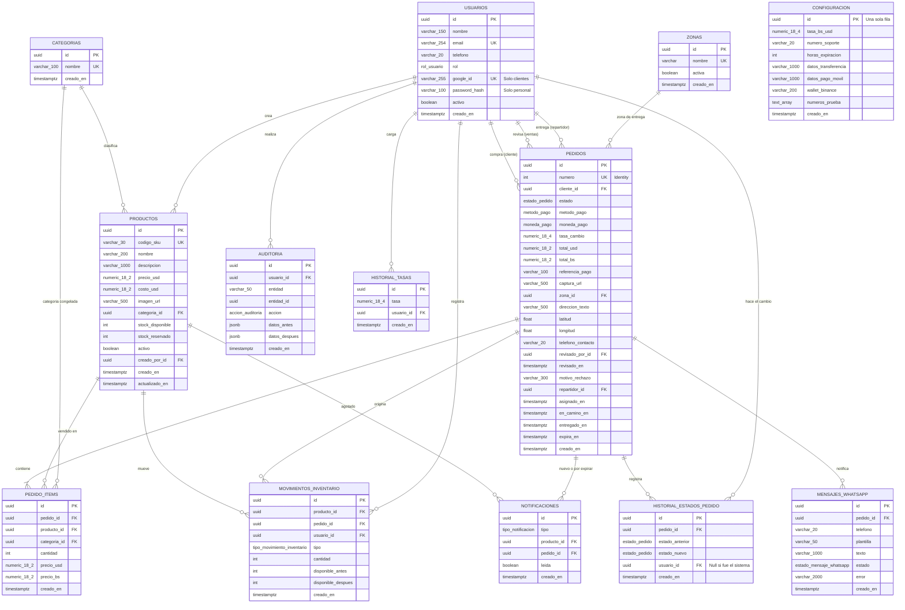

# Modelo de Datos

[← Volver al README](../README.md)

La base de datos es **PostgreSQL 16** y se genera con **Entity Framework Core 10 (Code-First)**. La configuración de cada tabla está en `Infrastructure/Persistencia/Configuraciones/` (Fluent API) y el script completo en [`database/InitialCreate.sql`](../database/InitialCreate.sql).

Convenciones:
- **Entidad base:** todas las entidades heredan de `BaseEntity` (`Core.Domain/Comun/BaseEntity.cs`), que define `Id` (`Guid`) y `CreatedAt` (`DateTime` en UTC). Por eso **todas las tablas** tienen `id` y `creado_en`.
- **Claves primarias UUID** en todas las tablas.
- **Fechas en UTC** (`timestamp with time zone`). `CreatedAt` se guarda en la columna `creado_en`, con `now()` por defecto; ese mapeo se configura una sola vez para todas las entidades en `ApplicationDbContext`.
- **Nombres en `snake_case`** (por ejemplo, la propiedad `StockDisponible` se guarda en la columna `stock_disponible`).
- **Montos** con precisión `numeric(18,2)` y tasas de cambio con `numeric(18,4)`.
- Las enumeraciones se guardan como **tipos enum nativos de PostgreSQL**.

---

## 1. Diagrama Entidad-Relación

---

## 2. Descripción de las Tablas

| Tabla | Para qué sirve |
| :--- | :--- |
| `categorias` | Secciones del supermercado (Víveres, Bebidas…). |
| `productos` | Catálogo. Guarda el stock en dos contadores: **disponible** (lo que se puede vender) y **reservado** (lo apartado por pedidos pendientes). El borrado es lógico con `activo`. |
| `usuarios` | Clientes y personal. Los clientes tienen `google_id`; el personal, `password_hash`. |
| `zonas` | Zonas de entrega; cada pedido indica la suya. |
| `pedidos` | Cada compra, con su estado, método de pago, comprobante, dirección, tasa de cambio congelada y fechas de cada etapa. |
| `pedido_items` | Productos de cada pedido, con **precio y categoría congelados** al momento de la compra. |
| `historial_estados_pedido` | Cada cambio de estado de un pedido: de qué estado a cuál, quién y cuándo. |
| `movimientos_inventario` | Cada entrada o salida de stock: reservas, ventas, liberaciones, reposiciones y ajustes. |
| `notificaciones` | Avisos para el personal: producto agotado, pedido nuevo y pedido por expirar. |
| `mensajes_whatsapp` | Registro de cada mensaje enviado (o bloqueado) al cliente. |
| `auditoria` | Quién cambió qué registro, con los datos antes y después en JSON. |
| `configuracion` | Parámetros del sistema: tasa del día, número de soporte, horas de expiración, datos de pago y números de prueba. |
| `historial_tasas` | Cada tasa de cambio cargada, con el usuario y la fecha. |

---

## 3. Restricciones de Integridad

Además de las claves foráneas, la base de datos protege las reglas del negocio con restricciones `CHECK` e índices únicos:

| Tabla | Restricción | Regla |
| :--- | :--- | :--- |
| `productos` | `precio_usd >= 0`, `costo_usd >= 0` | No hay precios negativos. |
| `productos` | `stock_disponible >= 0`, `stock_reservado >= 0` | El stock nunca queda negativo, incluso si dos compras llegan a la vez. |
| `productos` | `codigo_sku` único | No se repiten códigos. |
| `usuarios` | `ck_usuarios_credenciales` | Un cliente debe tener `google_id`; el personal debe tener `password_hash`. |
| `usuarios` | `email` y `google_id` únicos | Una cuenta por correo. |
| `pedidos` | `total_usd >= 0`, `total_bs >= 0`, `tasa_cambio > 0` | Totales y tasa válidos. |
| `pedidos` | `numero` único (columna *identity*) | Número correlativo legible (#1, #2…). |
| `pedido_items` | `cantidad > 0` | No hay líneas vacías. |
| `notificaciones` | `producto_id` o `pedido_id` obligatorio | Toda notificación apunta a algo. |
| `configuracion` | `id` fijo y `horas_expiracion > 0` | Solo existe una fila de configuración. |
| `historial_tasas` | `tasa > 0` | Tasas válidas. |
| `categorias`, `zonas` | `nombre` único | Sin duplicados. |

### Índices para consultas frecuentes
- `pedidos (estado, creado_en)` y `pedidos (estado, expira_en)`: bandeja de pendientes, job de expiración y KPIs.
- `pedidos (zona_id)` y `pedido_items (producto_id)`: ventas por zona y por producto.
- `productos (activo, stock_disponible)`: catálogo público.
- `movimientos_inventario (producto_id, creado_en)`: historial de movimientos de un producto.
- `notificaciones (leida, creado_en)`: notificaciones sin leer.
- `auditoria (creado_en)` y `auditoria (entidad, entidad_id)`: consultas de auditoría.

---

## 4. Enumeraciones

| Enum | Valores |
| :--- | :--- |
| `rol_usuario` | `cliente`, `ventas`, `repartidor`, `superadmin` |
| `estado_pedido` | `pendiente`, `aprobado`, `rechazado`, `expirado`, `asignado`, `en_camino`, `entregado` |
| `metodo_pago` | `transferencia`, `pago_movil`, `binance` |
| `moneda_pago` | `VES`, `USDT` |
| `tipo_movimiento_inventario` | `reserva`, `venta`, `liberacion`, `reposicion`, `ajuste` |
| `accion_auditoria` | `crear`, `editar`, `borrar`, `descargar_reporte` |
| `tipo_notificacion` | `stock_agotado`, `pedido_nuevo`, `pedido_por_expirar` |
| `estado_mensaje_whatsapp` | `enviado`, `error`, `bloqueado_lista_blanca` |

---

## 5. Datos Semilla

Incluidos en la migración inicial (`Infrastructure/Persistencia/Semillas/DatosSemilla.cs`):

| Categoría | Productos (SKU) |
| :--- | :--- |
| Víveres | VIV-0001 a VIV-0004 (harina, arroz, aceite…) |
| Lácteos y huevos | LAC-0001 a LAC-0003 (leche, queso, huevos) |
| Bebidas | BEB-0001, BEB-0002 (café, refresco) |
| Limpieza del hogar | LIM-0001, LIM-0002 (detergente, cloro) |

**Zonas de entrega:** Centro, Barrio Obrero, Pueblo Nuevo, La Concordia, Santa Teresa.

Al arrancar la API también se crean la fila de `configuracion` (con 5 horas de expiración) y el usuario superadmin inicial.
